# 2026 Summer Bot

Team 4296's off-season swerve-drive robot, coded entirely with AI-assisted tools (Claude Code).
The hardware is built to come apart fast: the roboRIO and driver camera mount on a removable mesh
backing, and the networking/vision gear is zip-tied into the top crate/cover that connects to the rest
of the robot with a single Ethernet cable. Wiring runs are cut to exact length and terminated in
lever nut connectors for clean, quick-swap routing.


## Index

- [Controls](#controls)
  - [Autonomous](#autonomous)
- [Driver-feel & traction control](#driver-feel--traction-control)
- [Vision](#vision)
- [Project layout](#project-layout)
- [Hardware](#hardware)
- [Miscellaneous hardware](#miscellaneous-hardware)
- [Images](#images)

## Controls

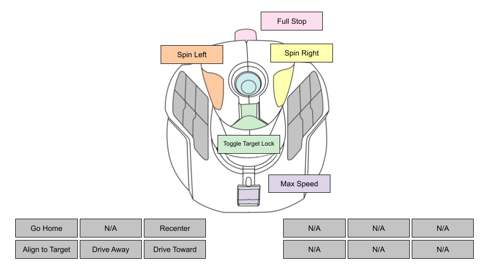

[Button Map File](https://docs.google.com/presentation/d/1TM2KT90CQzxj-xF5mtGECWA7Mnrt75R7sqwiD7auCAI/edit?slide=id.p#slide=id.p)

### Axes (field-centric driving)

| Control | Axis | Action |
|---|---|---|
| Stick forward/back | Y (1) | Drive forward/backward |
| Stick left/right | X (0) | Strafe |
| Stick twist | Twist (2) | Rotate in place |
| Throttle slider | Slider (3) | Top speed — back = fastest, forward = slowest |

Field-centric: "forward" is whatever direction the robot faces on its first enable after power-on,
or wherever it last faced when Recenter (button 7) was pressed.

### Buttons

| Button | Name | Behavior |
|---|---|---|
| 1 | Trigger | **Hold** — X-lock the wheels (brake). |
| 2 | Target lock | **Tap** to toggle. Robot will continually lock on to targets while moving.  If target is lost, robot will spin in a pulse like movement (fast, slow, fast) to find another target. |
| 3 | Force spin (CCW) | **Press** — burst of speed in a counterclockwise direction to look for new target.  Will enable target lock if not currently enabled. Same behavior when twisting axis past 25%. |
| 4 | Force spin (CW) | **Press** — same as button 3, but in a clockwise rotation. |
| 5 | Go home | **Press** — runs [`goHome.json`](src/main/deploy/goHome.json), teleop only. Cancels on any other stick/button input. |
| 7 | Recenter | **Press** — sets current heading as new field-centric "forward". Beeps to confirm. |
| 8 | Drive toward target | **Hold** — drive forward toward target while adjusting aim. |
| 9 | Drive away from target | **Hold** — drive backward from target. |
| 10 | Align with target | **Hold** — approach and align with the best-seen tag, refining while held. Loses priority to 8/9. |


### Autonomous

Scripted in [`autonomous.json`](src/main/deploy/autonomous.json) — a JSON array of plain-English
instructions run top to bottom, no code change needed to edit, just redeploy.

Additional script files can be added and bound to other buttons — 
[`goHome.json`](src/main/deploy/goHome.json) is a current example that utilizes button 5 during teleop mode.

```json
[
  "drive forward 3 feet",
  "wait 1 seconds",
  "rotate 90 degrees",
  "align with april tag 4"
]
```

**Instructions** (case-insensitive):

| Instruction | Notes |
|---|---|
| `drive <forward\|backward\|left\|right> <n> feet` | Odometry-based, robot-relative. |
| `drive toward target <n> feet` | Drives forward, correcting aim at any visible tag until it's out of frame, then straight. |
| `drive away from target <n> feet` | Same, backward. |
| `rotate <n> degrees [clockwise\|counterclockwise]` | Spin the robot a certain degrees (slightly inaccurate, so adjust as needed) |
| `wait <n> seconds` | Pause. |
| `align with april tag <n>` | Searches for that specific tag ID, faces it, gives up after a timeout. |
| `align with april tag <n> and go to it` | Same as above, but will arrive within 1m of target. |
| `recenter` | Same as button 7. |
| `vision rotation test` | Diagnostic — see below. |
| `play beep <n> times` | Plays the step-complete beep back to back. |

Blank lines or lines starting with `#`/`//` are comments. Any non-matching line rejects the whole
file (logged to RioLog) — no partial/guessed runs. Each step beeps on completion (Kraken motor,
no speaker hardware); tunable/disableable via `kStepCompleteBeep*` in `AutoConstants`. The whole
script finishing always plays 4 beeps, regardless of that setting to indicate the sequence is complete.

#### Vision rotation test

Diagnostic for finding max reliable spin rate for AprilTag detection. Put `vision rotation test`
alone in `autonomous.json` and run autonomous. Spins increasingly fast 360° sweeps (steady-rate,
then pulsed), logging unique tags seen per sweep to RioLog, until the count drops or top speed is
hit — then logs the best sequence.

## Driver-feel & traction control

- **Deadband** ~10%; response curve `stickFraction^2` above it; minimum output floor ~5% of top
  speed once past deadband; slew-rate input smoothing to prevent steer-motor chatter.
- **Traction control** `TractionControl` backs off commanded speed when a wheel or the whole
  chassis isn't achieving what was asked — per-wheel translation slip (compared to that wheel's
  own target) and whole-chassis rotation slip (Pigeon 2 yaw rate vs. commanded rate). 

## Vision

PhotonVision cameras provide AprilTag targeting. In combination with target lock, the robot will 
continually stay in alignment with an apriltag.  If the current tag is no longer seen, it the robot will
spin in search of another tag.

A Logitech C920 on the roboRIO's own USB port streams a plain driver-view feed to the Driver
Station (separate from the PhotonVision cameras) — low res/fps to save radio bandwidth.

## Project layout

| File | Purpose |
|---|---|
| [`RobotContainer.java`](src/main/java/frc/robot/RobotContainer.java) | Central wiring class — builds the drivetrain/vision subsystems, binds every flight-stick control (drive, target lock, force-spin, hold-to-drive-toward/away/line-up buttons, recenter, go home), and constructs the autonomous command from `AutoScript`/`AutoStep`. Holds most of the actual driving logic: stick shaping, field- vs. robot-centric requests, AprilTag alignment math, and the command builders that turn each parsed instruction into a runnable `Command`. Also owns the target-lock state machine (toggle vs. hold, suspension, forced-clockwise latching) and the shared step-complete beep commands. |
| [`PulsedSearch.java`](src/main/java/frc/robot/PulsedSearch.java) | Turns a continuous search spin into alternating fast/slow pulses so the camera gets steadier looks at AprilTags instead of only seeing them blur past. Reset once when a search starts, then polled every loop via `pulse()` for the current commanded rate; can fall back to one steady rate if pulsing is disabled in `Constants`. Shared by target lock, the `align with april tag` instructions, and `VisionRotationTest`. |
| [`VisionRotationTest.java`](src/main/java/frc/robot/VisionRotationTest.java) | Implements the `vision rotation test` diagnostic step — not used in matches, just for finding how fast the robot can spin while still reliably seeing tags. Runs increasingly fast 360° sweeps (steady-rate, then `PulsedSearch`'s pulsed pattern), logging unique tag count and duration per sweep and stopping a phase once the count drops or top turn rate is hit. Silences routine console logging during the run and reports the single best sequence at the end. |
| [`Constants.java`](src/main/java/frc/robot/Constants.java) | All of the robot's tunable numbers/flags, grouped into nested classes: `OperatorConstants` (axis/button mapping, deadbands, curves), `VisionConstants` (alignment PID gains, search-spin timing), `AutoConstants` (speeds/tolerances/timeouts per instruction type), `RotationTestConstants`, and `TractionConstants` (slip thresholds/correction gains). Pure data, no logic — several values carry comments documenting when/why they were tuned on the real robot. |
| [`AutoScript.java`](src/main/java/frc/robot/AutoScript.java) | Parses a JSON array of plain-English instruction strings (`autonomous.json`/`goHome.json`) into `AutoStep`s using one regex per supported instruction. Comment/blank lines are skipped; any unrecognized line rejects the whole file (logged via `RobotLog`) rather than running a partially-parsed script, so a typo can't silently truncate a routine. |
| [`AutoStep.java`](src/main/java/frc/robot/AutoStep.java) | A sealed interface with one record type per supported instruction (`Drive`, `DriveToward`, `Rotate`, `AlignTag`, `LineUpTag`, `PlayBeep`, etc.), each holding just the data needed to run it. `AutoScript` produces these from parsed text, and `RobotContainer.autoStepCommand` pattern-matches on them to build the actual `Command`. |
| [`deploy/autonomous.json`](src/main/deploy/autonomous.json) | The deployed match autonomous script, parsed by `AutoScript`/`AutoStep`. The active routine aligns to and drives up to three AprilTags in sequence with waits/backups between each, then recenters and does a small rotation wiggle; the rest of the file is commented-out reference lines showing every supported instruction format. |
| [`deploy/goHome.json`](src/main/deploy/goHome.json) | Button 5's teleop "go home" script, same format as `autonomous.json`, run via `RobotContainer.goHomeCommand()`. Beeps, aligns to and drives up to a specific AprilTag, rotates to a set heading, and recenters — cancels itself immediately if the driver touches any other control. |
| [`subsystems/Vision.java`](src/main/java/frc/robot/subsystems/Vision.java) | Wraps a single PhotonVision camera, caching the best-seen AprilTag target and the full list of visible targets once per periodic loop so every consumer sees a consistent result within that loop. Exposes helpers for whether a tag's in view, looking one up by fiducial ID, the best target's yaw/distance/timestamp, and the set of visible IDs — logging to console whenever that set changes. |
| [`subsystems/CommandSwerveDrivetrain.java`](src/main/java/frc/robot/subsystems/CommandSwerveDrivetrain.java) | The swerve drivetrain subsystem, generated from CTRE's Tuner X template and extended with SysId characterization, alliance-based operator-perspective handling, and simulation support. Its key customization overrides `setControl` to route every `FieldCentric`/`RobotCentric` drive request through `TractionControl` before handing it to the underlying CTRE swerve control, leaving non-drive requests (Idle, brake, SysId) untouched. |
| [`subsystems/TractionControl.java`](src/main/java/frc/robot/subsystems/TractionControl.java) | An "electronic limited slip differential" applied automatically to every drive command via `CommandSwerveDrivetrain.setControl`. `correctTranslation` scales commanded velocity down based on the worst-slipping wheel's actual-vs-target speed ratio; `correctRotation` scales down commanded rotation when the gyro's measured yaw rate persistently lags the commanded rate — both log once when slip starts/stops rather than every loop. |
| [`generated/TunerConstants.java`](src/main/java/frc/robot/generated/TunerConstants.java) | Generated/adapted swerve hardware config for the four SDS Mk5n modules — CAN IDs, gear ratios, wheel radius, inversions, encoder offsets, PID/feedforward gains, and current limits. Also defines the `TunerSwerveDrivetrain` base class and the `createDrivetrain()` factory `RobotContainer` uses to build the `CommandSwerveDrivetrain`. |
| [`Robot.java`](src/main/java/frc/robot/Robot.java) | The top-level `TimedRobot` subclass WPILib calls into for each mode. On construction it prunes old SignalLogger session folders, starts streaming the USB driver camera to the Driver Station, and instantiates `RobotContainer`; `robotPeriodic` runs the `CommandScheduler`, and the mode-init methods schedule/cancel the autonomous command and clear commands entering test mode. |

## Hardware

**Team 4296.**

- **[roboRIO v1](https://firstwiki.github.io/wiki/roborio)** — main robot controller (too weak to
  run AprilTag detection itself).
- **[OrangePi 5](http://www.orangepi.org/html/hardWare/computerAndMicrocontrollers/details/Orange-Pi-5.html)**
  coprocessor running [PhotonVision](http://10.42.96.11:5800/#/dashboard), two cameras plugged
  directly into its own USB ports (no hub):
  - **[Arducam OV9281](https://www.arducam.com/blog/product/arducam-1mp-ov9281-global-shutter-usb-camera-board-with-low-distortion-m12-lens-dual-microphones-uvc-usb2-0-webcam-module-for-computer-laptop-android-device-and-raspberry-pi-ub0232/)**
    (global shutter) — AprilTags, named `OV9281_April_Tags` in PhotonVision.
  - **[Arducam OV9782](https://www.arducam.com/100fps-global-shutter-color-usb-camera-board-1mp-ov9782-uvc-webcam-module-with-low-distortion-m12-lens-without-microphones-for-computer-laptop-android-device-and-raspberry-pi-arducam.html)**
    — object detection (RKNN models on the RK3588S NPU), nicknamed `OV9782_Object_Detection` in
    PhotonVision. Not yet wired into robot code.
  - **[Pololu D24V50F5](https://www.pololu.com/product/2851)** for power which provides a 12V to
    5V/5A step-down regulator, fed by PoE from the VH-109 radio.
- **[Logitech C920](https://www.logitech.com/en-us/products/webcams/c920s-pro-hd-webcam.html)** —
  plain driver-view webcam on the roboRIO's own USB port (not a vision camera).
- **[Thrustmaster T.16000M](https://www.thrustmaster.com/en-us/products/t-16000m-fcs/)** flight
  stick — driver controller, Driver Station USB port 0.
- **[Vivid-Hosting VH-109](https://frc-radio.vivid-hosting.net/)** radio (1 PoE uplink + 4 LAN).
  Static IPs: roboRIO `10.42.96.2`, OrangePi `10.42.96.11`.
- **[REV Power Distribution Hub](https://www.revrobotics.com/rev-11-1850/) (REV-11-1850)** — power
  delivery from the main battery, CAN-connected. 20 high-current channels (40A max each), 3
  low-current channels (15A continuous/20A peak), 1 switchable low-current channel for indicators.
- **[REV Mini Power Module](https://www.revrobotics.com/rev-11-1956/) (REV-11-1956)** — expansion
  module off the PDH for powering peripherals/custom circuits. 6 channels, 15A each (40A total),
  12V nominal input, ATM fuses.
- **Swerve drivetrain** — **[SDS Mk5n](https://www.swervedrivespecialties.com/products/mk5n-swerve-module)**
  modules, all on the roboRIO onboard CAN bus:
  - **[Kraken X60](https://store.ctr-electronics.com/products/kraken-x60)** — drive motor (CAN IDs 4–7).
  - **[Kraken X44](https://store.ctr-electronics.com/products/kraken-x44)** — steer motor (CAN IDs 0–3).
  - **[CTRE CANcoder](https://store.ctr-electronics.com/products/cancoder)** — azimuth encoder, one
    per module (CAN IDs 11–14).
  - **[CTRE Pigeon 2](https://store.ctr-electronics.com/products/pigeon-2)** — gyro (CAN ID 20).
- Frame 14.5 in × 12.75 in, wheelbase/trackwidth 9 in × 7.25 in, 4 in wheels, measured top speed
  ~5.85 m/s at 12V.

## Miscellaneous hardware

- 2x4 wood
- 5/8" particle board
- **[5-Gallon Paint Bucket Grid](https://www.harborfreight.com/5-gallon-paint-bucket-grid-57370.html)**
- **[1" Roller Ball Bearing](https://www.harborfreight.com/1-inch-roller-ball-bearing-67060.html)**
- **[Storage Crate](https://www.target.com/p/storage-crate-black-room-essentials-8482/-/A-75666888)**
- Pool noodles

## Images

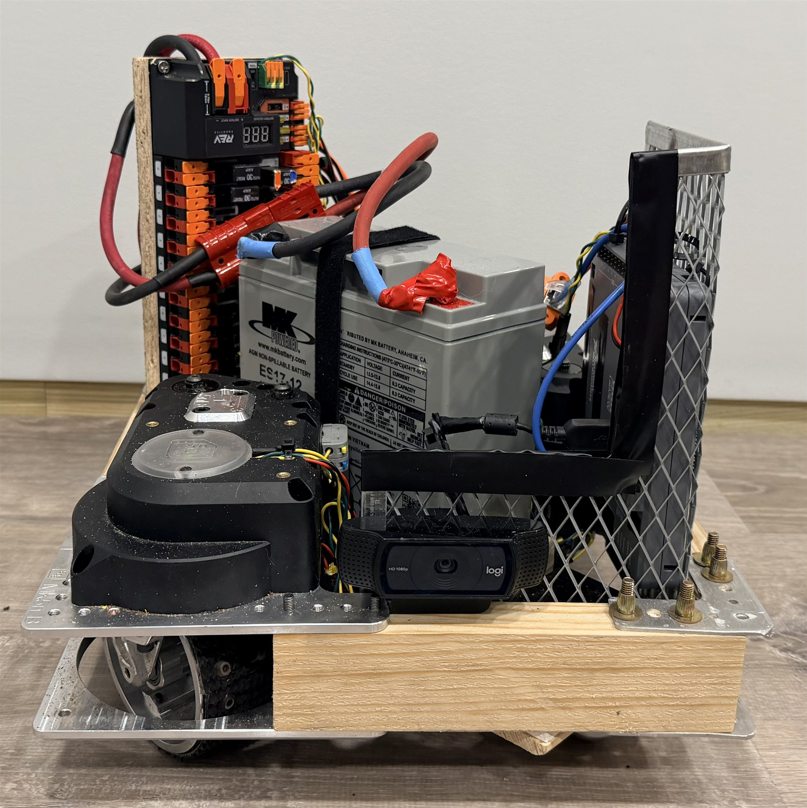
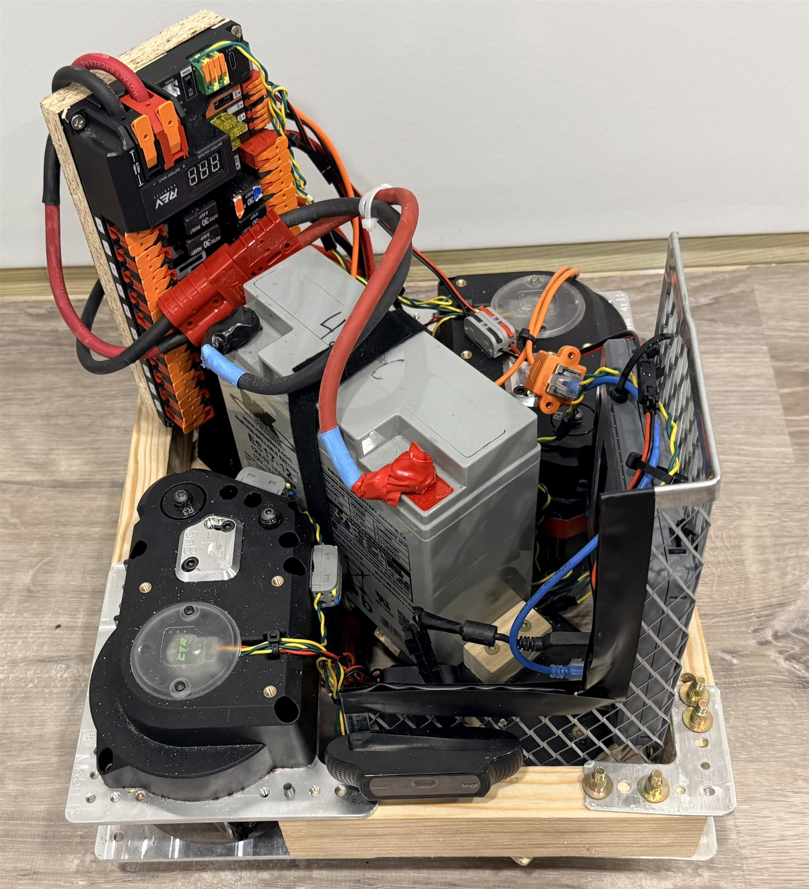
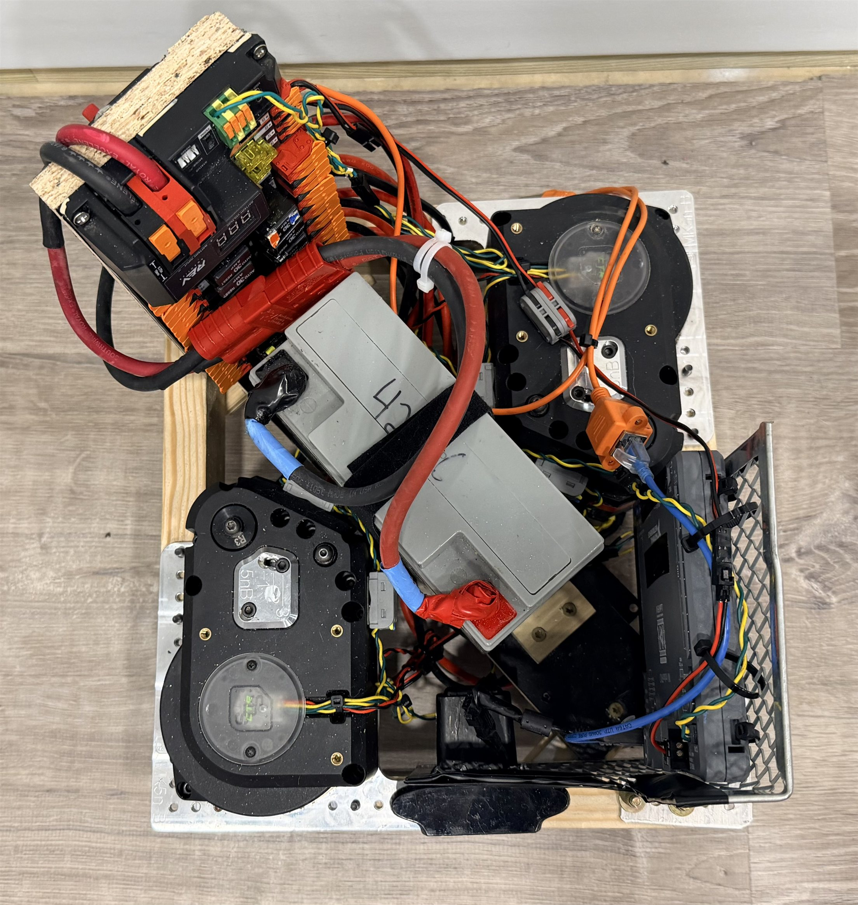
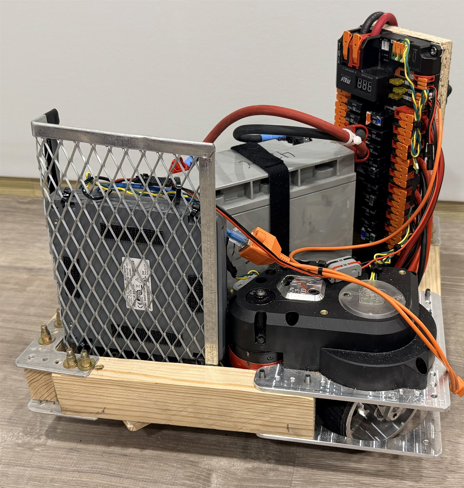
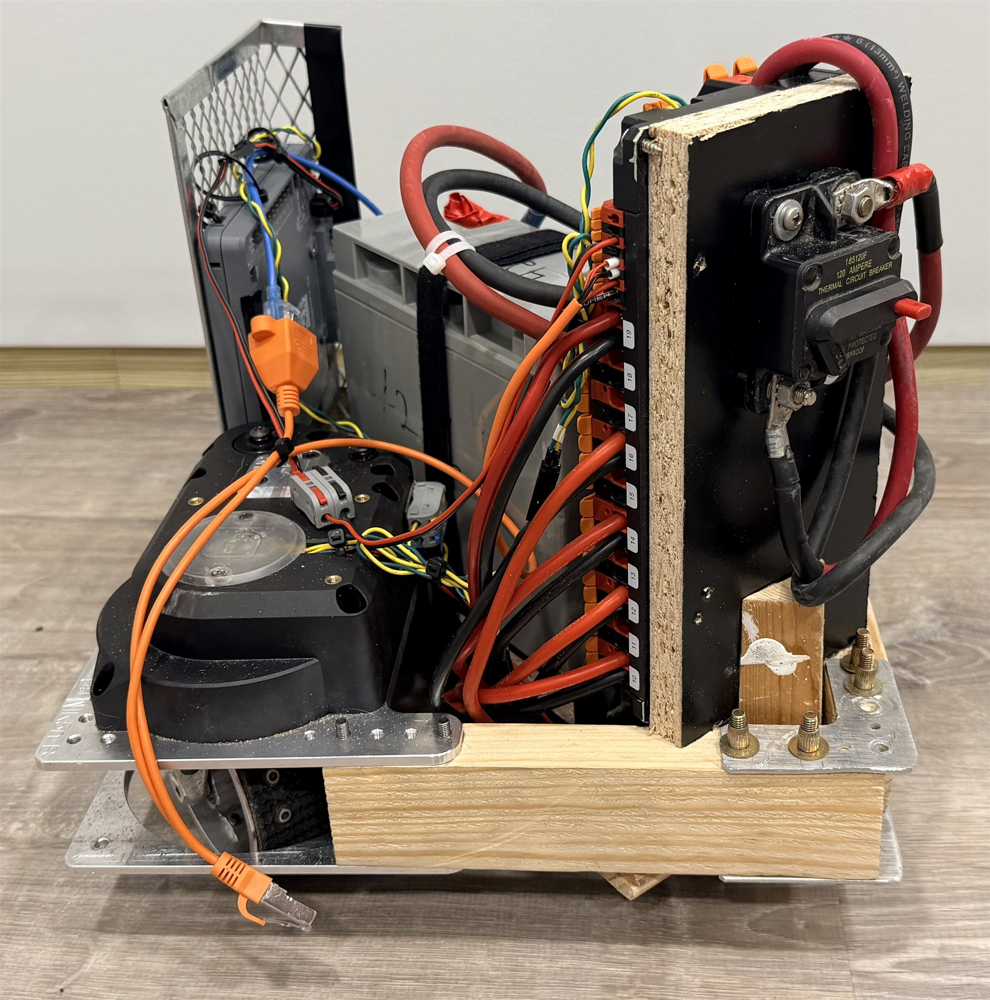
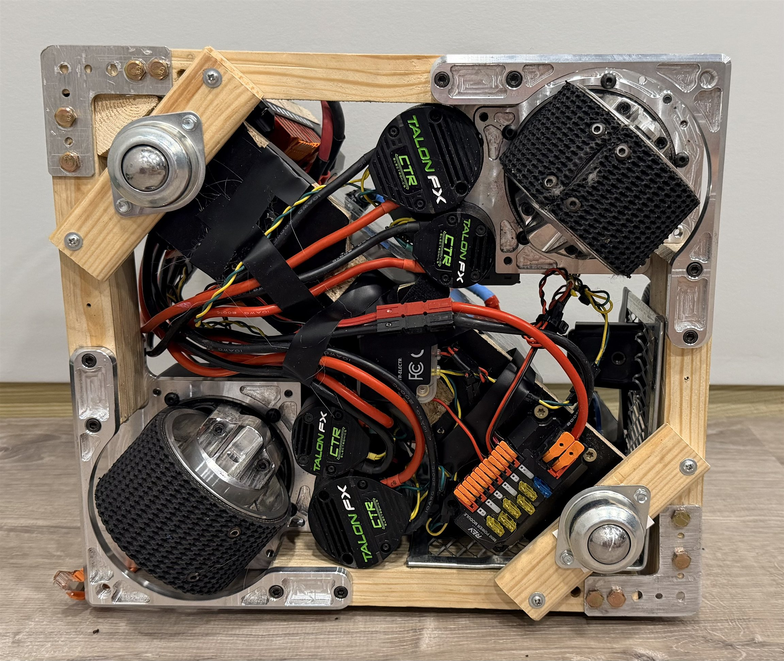
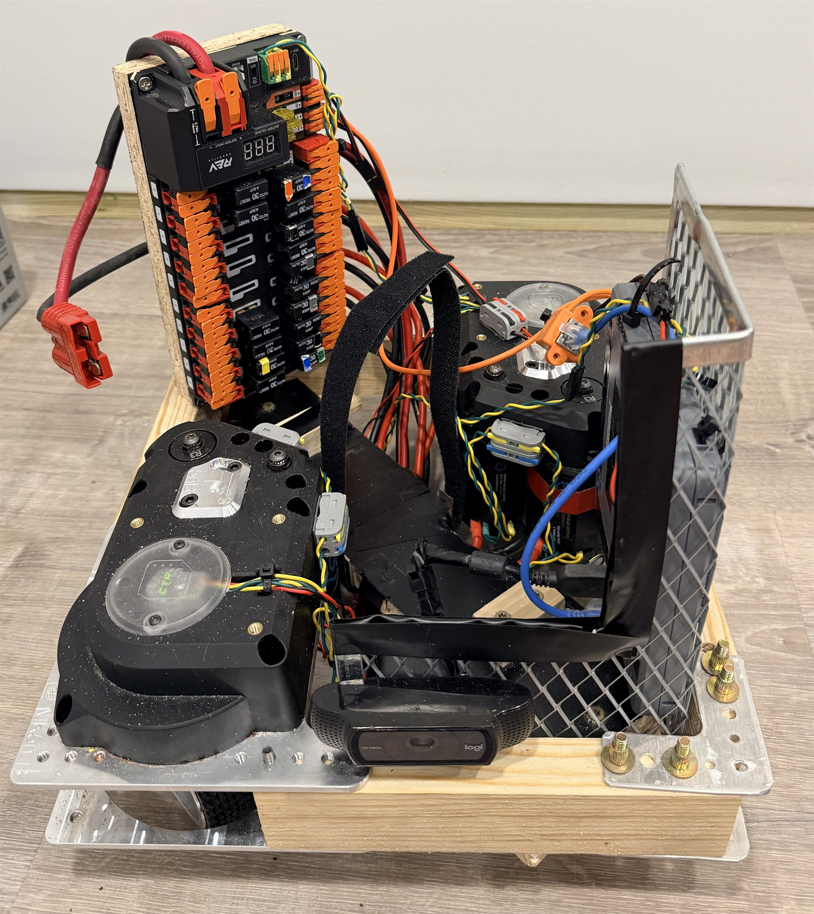
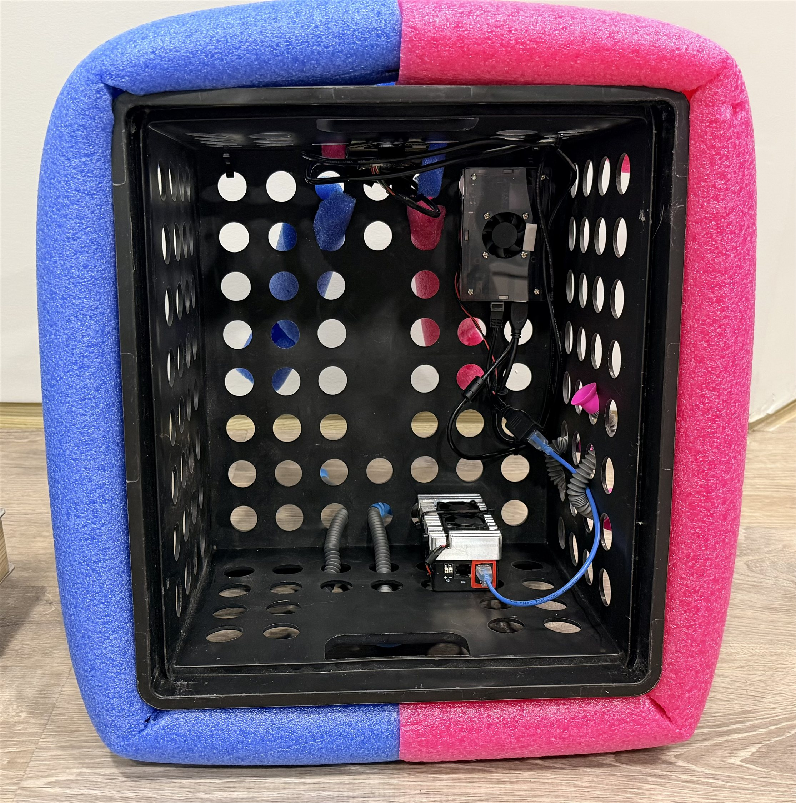
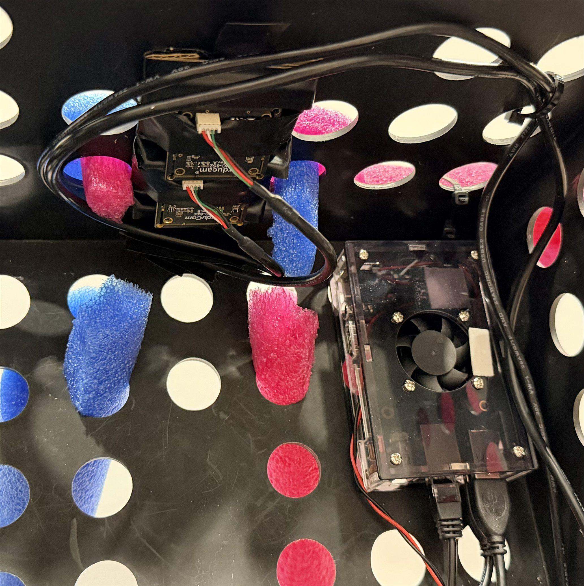
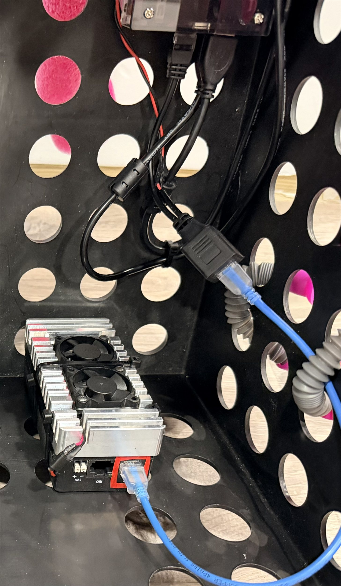
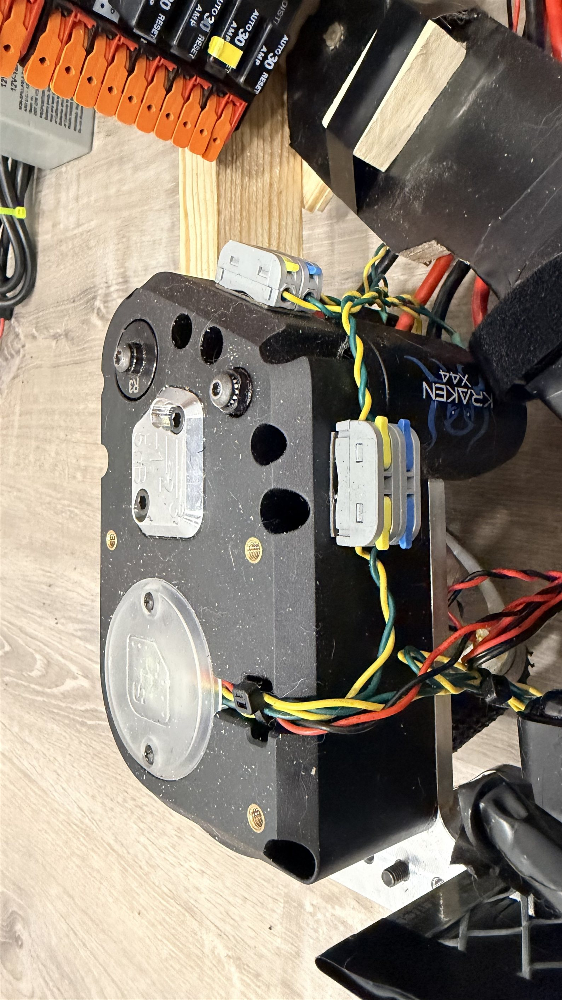
